# CSNePS Knowledge Graph Service - Advanced Reasoning & Ontology Engineering

## 🎯 Executive Summary

**CSNePS Knowledge Graph Service** is a production-ready enterprise system that bridges symbolic AI reasoning with modern ontology engineering. The system combines **CSNePS** (Cognitive Systems for Natural language Processing and Structured information) - a powerful semantic network reasoning engine - with comprehensive **OWL** ontology support, advanced graph visualization through **JUNG**, and enterprise-grade API infrastructure.

### Key Value Propositions

| Category | Description | Benefit |
|----------|-------------|---------|
| **Hybrid AI Architecture** | Combines symbolic reasoning (CSNePS) with semantic web technologies (OWL/RDF) | Explainable AI decisions with formal knowledge representation |
| **Enterprise Integration** | RESTful APIs, gRPC services, JSON Schema validation | Production-ready deployment with type-safe interfaces |
| **Ontology Engineering** | Full OWL import/export, SHACL validation, Protégé compatibility | Standards-compliant knowledge modeling and validation |
| **Advanced Visualization** | JUNG framework with multiple layout algorithms and SVG export | Interactive knowledge graph exploration and analysis |
| **Real-time Processing** | Streaming APIs, incremental reasoning, concurrent processing | Responsive knowledge updates for dynamic environments |

### Target Applications

- **🤖 Robotics & Autonomous Systems**: Knowledge-driven navigation, planning, and decision-making
- **🏥 Medical Reasoning**: Clinical decision support with explainable diagnostic pathways
- **🏭 Enterprise Knowledge Management**: Formal organizational knowledge with reasoning capabilities
- **🔬 Research & Development**: Semantic data integration and hypothesis generation
- **🎓 Educational Systems**: Intelligent tutoring with knowledge graph foundations

## 🧠 Technology Deep Dive

### What is CSNePS?

**CSNePS** (Cognitive Systems for Natural language Processing and Structured information) is a sophisticated semantic network system designed for knowledge representation and reasoning, originally developed at the University at Buffalo.

#### Core Concepts

| Concept | Description | Purpose |
|---------|-------------|---------|
| **Semantic Networks** | Graph-based knowledge representation where nodes represent concepts and arcs represent relationships | Natural representation of complex, interconnected knowledge |
| **Inference Paths** | Logical reasoning chains through the semantic network | Provides explainable AI with complete justification trails |
| **Belief Spaces** | Contextualized knowledge environments supporting multiple viewpoints | Enables reasoning with conflicting or uncertain information |
| **Rule-based Reasoning** | Forward and backward chaining through semantic relationships | Automated deduction and knowledge discovery |

#### Why CSNePS for Knowledge Graphs?

- **Explainable AI**: Every conclusion includes complete reasoning paths
- **Dynamic Knowledge**: Real-time assertion and retraction of knowledge
- **Natural Language Integration**: Built-in support for linguistic knowledge representation
- **Contextual Reasoning**: Supports multiple belief contexts and viewpoints

### What are Ontologies?

**Ontologies** are formal specifications of shared conceptualizations - they define the vocabulary, relationships, and constraints within a knowledge domain using mathematical logic.

#### OWL (Web Ontology Language)

| Feature | Description | Example |
|---------|-------------|---------|
| **Classes & Hierarchies** | Taxonomic organization of concepts | `Robot ⊑ AutonomousAgent ⊑ Agent` |
| **Object Properties** | Relationships between individuals | `hasLocation`, `canPerform`, `isPartOf` |
| **Data Properties** | Attributes with literal values | `hasSpeed`, `hasSerialNumber`, `operatingVoltage` |
| **Logical Axioms** | Formal constraints and rules | `Robot ⊓ hasLocation.some(DangerousArea) → RequiresSafetyProtocol` |

#### Why Ontologies Matter

- **Interoperability**: Standard vocabularies enable system integration
- **Validation**: Formal constraints ensure data quality and consistency
- **Reasoning**: Logical axioms enable automated knowledge discovery
- **Documentation**: Self-documenting knowledge models with formal semantics

### What is Protégé?

**Protégé** is the world's leading ontology development environment, providing graphical tools for creating, editing, and debugging OWL ontologies.

#### Integration Benefits

| Capability | Description | Impact |
|------------|-------------|--------|
| **Visual Ontology Design** | Drag-and-drop class hierarchies and property relationships | Rapid ontology development and iteration |
| **Reasoning Integration** | Built-in OWL reasoners (HermiT, Pellet, FaCT++) | Real-time consistency checking and classification |
| **Plugin Ecosystem** | Extensible architecture with specialized tools | Custom workflows for domain-specific requirements |
| **Export Compatibility** | Multiple serialization formats (RDF/XML, Turtle, OWL/XML) | Seamless integration with our CSNePS pipeline |

### What is JUNG?

**JUNG** (Java Universal Network/Graph Framework) is a comprehensive library for modeling, analysis, and visualization of graph-structured data.

#### Visualization Capabilities

| Algorithm | Description | Use Case |
|-----------|-------------|---------|
| **Spring Layout** | Force-directed positioning with configurable attraction/repulsion | General knowledge graph exploration |
| **Circular Layout** | Nodes arranged in circular patterns | Hierarchical relationship visualization |
| **Tree Layout** | Hierarchical tree structures | Ontology class hierarchies and reasoning trees |
| **Static Layout** | User-defined positioning | Custom domain-specific visualizations |

#### Why JUNG for Knowledge Graphs?

- **Scalability**: Efficiently handles large graphs with thousands of nodes
- **Interactivity**: Mouse-based navigation, zooming, and selection
- **Export Options**: SVG, PNG, PDF generation for reports and documentation
- **Algorithm Library**: Centrality analysis, clustering, shortest paths

### What is Knoodl-Style Processing?

**Knoodl-style** refers to a modern approach to knowledge graph engineering that emphasizes:

#### Core Principles

| Principle | Description | Implementation |
|-----------|-------------|----------------|
| **API-First Design** | RESTful interfaces as primary interaction method | Ring HTTP server with JSON schema validation |
| **Microservice Architecture** | Loosely-coupled, independently deployable components | Separate OWL tools, visualization, and reasoning services |
| **Real-time Streaming** | Continuous knowledge updates and query processing | WebSocket support and incremental reasoning |
| **Cloud-Native Deployment** | Container-based deployment with orchestration support | Docker images with Kubernetes manifests |

### What is NLP Integration?

**Natural Language Processing** integration enables the system to process human language and convert it into formal knowledge representations.

#### NLP Pipeline Components

| Stage | Technology | Purpose |
|-------|------------|---------|
| **Tokenization** | OpenNLP, SpaCy | Break text into linguistic units |
| **Named Entity Recognition** | Stanford NER, spaCy | Identify entities (persons, places, organizations) |
| **Dependency Parsing** | Stanford Parser | Extract grammatical relationships |
| **Semantic Role Labeling** | AllenNLP, PropBank | Identify predicate-argument structures |
| **Knowledge Extraction** | Custom CSNePS rules | Convert linguistic structures to semantic networks |

### What is gRPC?

**gRPC** (Google Remote Procedure Call) is a high-performance, cross-language RPC framework that enables efficient communication between distributed services.

#### gRPC in Our Architecture

| Feature | Benefit | Use Case |
|---------|---------|----------|
| **Protocol Buffers** | Efficient binary serialization | Fast knowledge graph updates and queries |
| **Streaming Support** | Bidirectional real-time communication | Continuous reasoning updates and live visualization |
| **Language Agnostic** | Java, Python, Go, JavaScript clients | Multi-language ecosystem integration |
| **HTTP/2 Foundation** | Multiplexing, flow control, header compression | High-throughput knowledge operations |

### What is SHACL?

**SHACL** (Shapes Constraint Language) is a W3C standard for validating RDF graphs against sets of conditions (shapes).

#### SHACL Validation Types

| Constraint Type | Description | Example |
|----------------|-------------|---------|
| **Cardinality** | Minimum/maximum occurrence constraints | `Robot` must have exactly one `serialNumber` |
| **Value Type** | Data type and class constraints | `hasSpeed` must be a decimal value |
| **Value Range** | Allowed value specifications | `batteryLevel` must be between 0 and 100 |
| **Pattern Matching** | Regular expression validation | `ipAddress` must match IP address format |
| **Logical Constraints** | Complex conditional validation | If `isAutonomous` then must have `navigationSystem` |

#### Integration with CSNePS

1. **Ontology Validation**: Ensure OWL axioms are well-formed before CSNePS conversion
2. **Data Quality**: Validate instance data against domain constraints
3. **Runtime Checking**: Continuous validation of knowledge assertions
4. **Error Reporting**: Detailed violation reports with correction suggestions

## 🏗️ System Architecture

### Architectural Overview

```mermaid
graph TB
    subgraph "Client Layer"
        A1[Protégé Desktop]
        A2[Python NLP Pipeline]
        A3[Web Dashboard]
        A4[ROS 2 Nodes]
    end

    subgraph "API Gateway"
        B1[Ring HTTP Server<br/>Port 3000]
        B2[gRPC Service<br/>Port 50051]
        B3[WebSocket<br/>Real-time Updates]
    end

    subgraph "Core Processing"
        C1[CSNePS Engine<br/>Clojure]
        C2[OWL Processor<br/>Java/Maven]
        C3[SHACL Validator<br/>Apache Jena]
        C4[JUNG Renderer<br/>Graph Visualization]
    end

    subgraph "Data Layer"
        D1[OWL Ontologies<br/>core.owl]
        D2[SHACL Shapes<br/>*.ttl]
        D3[JSON Schemas<br/>API Validation]
        D4[Knowledge Base<br/>Semantic Network]
    end

    A1 --> B1
    A2 --> B2
    A3 --> B3
    A4 --> B1

    B1 --> C1
    B2 --> C1
    B3 --> C1

    C1 --> C2
    C2 --> C3
    C1 --> C4

    C2 --> D1
    C3 --> D2
    B1 --> D3
    C1 --> D4
```



### Component Responsibilities

#### 1. Ring HTTP Bridge (`csri/http_server.clj`)

**Purpose**: Primary API gateway providing RESTful access to CSNePS reasoning capabilities.

**Technology Stack**:

- **Ring 1.11.0**: Clojure web application library
- **ring-json 0.5.1**: JSON request/response middleware
- **cheshire 5.12.0**: High-performance JSON parsing

**Why Ring?**

- **Functional Architecture**: Composable middleware pipeline
- **Performance**: Efficient handling of concurrent requests
- **Clojure Integration**: Native integration with CSNePS core
- **Simplicity**: Minimal configuration with maximum flexibility

**Endpoints & Operations**:

| Endpoint | Method | Purpose | Example |
|----------|--------|---------|---------|
| `/assert` | POST | Add knowledge to semantic network | Assert facts, rules, relationships |
| `/query` | POST | Query knowledge base | Pattern matching, variable binding |
| `/why` | POST | Generate justification explanations | Proof trees, reasoning paths |
| `/render` | POST | Create graph visualizations | SVG exports, interactive views |

#### 2. OWL Processing Tools (`java/csri-owl-tools/`)

**Purpose**: Enterprise-grade ontology processing and validation pipeline.

**Technology Stack**:

- **OWL API 5.5.0**: Industry standard for OWL ontology manipulation
- **Apache Jena 4.10.0**: RDF framework with SPARQL query engine
- **SHACL Validation**: W3C standard constraint validation

**Key Components**:

| Component | Responsibility | Output |
|-----------|----------------|---------|
| `OwlToCsnepsConverter` | Convert OWL axioms to CSNePS rules | Semantic network assertions |
| `ShaclValidatorTool` | Validate RDF data against shapes | Constraint violation reports |
| `OntologyLoader` | Load and parse OWL files | Validated ontology models |

**Conversion Process**:

1. **Parse OWL**: Load ontology using OWL API
2. **Validate Structure**: Check logical consistency with reasoners
3. **SHACL Checking**: Validate instances against constraints
4. **Rule Generation**: Convert axioms to CSNePS inference rules
5. **Assertion**: Load rules into semantic network

#### 3. JUNG Graph Renderer (`java/jung-renderer/`)

**Purpose**: Advanced graph visualization with multiple layout algorithms and export capabilities.

**Technology Stack**:

- **JUNG 2.1.1**: Comprehensive graph analysis and visualization
- **Batik 1.17**: SVG generation and manipulation
- **AWT/Swing**: Cross-platform graphics rendering

**Visualization Features**:

| Feature | Implementation | Benefits |
|---------|----------------|----------|
| **Layout Algorithms** | FRLayout, CircleLayout, TreeLayout | Optimal visualization for different graph types |
| **Interactive Navigation** | Mouse controls, zoom, pan | Exploratory knowledge discovery |
| **Export Formats** | SVG, PNG, PDF | Documentation and presentation |
| **Styling Options** | Colors, shapes, labels | Domain-specific visualization |

#### 4. JSON Schema Validation

**Purpose**: Type-safe API contracts ensuring data integrity across all interfaces.

**Schema Categories**:

| Schema | Purpose | Validation Rules |
|--------|---------|------------------|
| `assertion.schema.json` | Single knowledge assertions | Subject-predicate-object validation |
| `assert-batch.schema.json` | Bulk knowledge operations | Array validation with size limits |
| `query.schema.json` | Query pattern validation | Variable binding and pattern syntax |
| `justification.schema.json` | Explanation request format | Assertion reference validation |

## 📊 Built Artifacts & Capabilities

### Java Components

**csri-owl-tools-1.0-jar-with-dependencies.jar** (17.9MB)

- Complete OWL API and Jena dependencies
- SHACL validation tools
- Ontology conversion utilities
- Production-ready enterprise libraries

**jung-renderer-1.0-jar-with-dependencies.jar** (3.2MB)

- Full JUNG visualization framework
- Batik SVG rendering engine
- Multiple layout algorithms
- Export capabilities (SVG, PNG, PDF)

## 🛠️ Technical Stack Summary

### Core Infrastructure

- **CSNePS Core**: Clojure 1.11.1 semantic network reasoning
- **Ring Server**: HTTP API with JSON middleware
- **Maven Build**: Multi-module Java project structure
- **JVM Integration**: Seamless Clojure-Java interoperability

### Data Validation & Quality

- **JSON Schema**: API contract validation
- **SHACL Shapes**: RDF data constraint checking
- **OWL Reasoning**: Logical consistency validation
- **Type Safety**: Strong typing across all interfaces

### Knowledge Base & Ontologies

- **core.owl**: Robot entities, areas, and spatial relationships
- **core-shapes.ttl**: SHACL validation rules for robotics domain
- **Sample Data**: Production-ready robotics ontology examples
- **Extension Points**: Modular design for domain-specific ontologies

## 🚀 API Reference Guide

### Assertion Endpoints

```bash
# Single assertion
curl -X POST http://localhost:3000/assert \
  -H "Content-Type: application/json" \
  -d '{"subject": "Robot1", "predicate": "locatedIn", "object": "RoomA"}'

# Batch assertions with validation
curl -X POST http://localhost:3000/assert-batch \
  -H "Content-Type: application/json" \
  -d '{"assertions": [...]}'
```

### Query Interface

```bash
# Pattern matching queries
curl -X POST http://localhost:3000/query \
  -H "Content-Type: application/json" \
  -d '{"pattern": ["?robot", "locatedIn", "RoomA"]}'

# Variable binding with constraints
curl -X POST http://localhost:3000/query \
  -H "Content-Type: application/json" \
  -d '{"pattern": ["?robot", "?relation", "?location"], "constraints": {...}}'
```

### Justification Engine

```bash
# Get reasoning explanation
curl -X POST http://localhost:3000/why \
  -H "Content-Type: application/json" \
  -d '{"assertion": "Robot1 locatedIn RoomA"}'
```

### Visualization Rendering

```bash
# Generate SVG visualization
curl -X POST http://localhost:3000/render \
  -H "Content-Type: application/json" \
  -d '{"layout": "spring", "format": "svg", "nodes": [...], "edges": [...]}'
```

## 🏗️ Build & Development

### Quick Start

```bash
# 1. Clone repository
git clone <repository-url>
cd csneps-robotics-inference

# 2. Build Java components
cd java
mvn clean install

# 3. Start CSNePS REPL
cd ../csri
lein repl

# 4. Load HTTP server
(load-file "http_server.clj")
(start-server)
```

### Maven Build Status

| Module | Status | Output Size | Dependencies |
|--------|--------|-------------|--------------|
| csri-owl-tools | ✅ SUCCESS | 17.9MB | OWL API, Jena, SHACL |
| jung-renderer | ✅ SUCCESS | 3.2MB | JUNG, Batik, AWT |

### Development Workflow

1. **Ontology Design**: Create OWL files using Protégé
2. **Validation**: Apply SHACL shapes for data quality
3. **Conversion**: Transform OWL to CSNePS using Java tools
4. **Reasoning**: Load knowledge into CSNePS semantic network
5. **Visualization**: Generate graphs using JUNG renderer
6. **API Integration**: Access via Ring HTTP endpoints

## 🎯 Production Deployment

### Container Strategy

```dockerfile
FROM openjdk:17-jdk-slim

# Install Clojure and Leiningen
RUN curl -O https://download.clojure.org/install/linux-install-1.11.1.1273.sh
RUN chmod +x linux-install-1.11.1.1273.sh && ./linux-install-1.11.1.1273.sh

# Copy application files
COPY . /app
WORKDIR /app

# Build Java components
RUN cd java && mvn clean install

# Expose API port
EXPOSE 3000

CMD ["lein", "run"]
```

### Scaling Considerations

| Component | Scaling Strategy | Resource Requirements |
|-----------|------------------|----------------------|
| **Ring HTTP Server** | Horizontal scaling behind load balancer | 2-4 CPU cores, 4-8GB RAM |
| **CSNePS Engine** | Vertical scaling with larger JVM heap | 8-16GB RAM for large knowledge bases |
| **OWL Processing** | Batch processing with queue systems | CPU-intensive, 4-8 cores recommended |
| **JUNG Renderer** | Stateless microservice deployment | Memory-intensive for large graphs |

## 🔮 Future Enhancements

### Roadmap Categories

| Category | Timeline | Priority | Description |
|----------|----------|----------|-------------|
| **ROS 2 Integration** | Q1 2024 | 🔴 Critical | Native ROS 2 message support and service nodes |
| **Real-time Streaming** | Q2 2024 | 🟠 High | WebSocket APIs for live knowledge updates |
| **NLP Pipeline** | Q2 2024 | 🟠 High | Natural language to knowledge graph conversion |
| **Performance Optimization** | Q3 2024 | 🟡 Medium | Incremental reasoning and caching strategies |
| **Cloud Deployment** | Q3 2024 | 🟡 Medium | Kubernetes manifests and cloud-native features |
| **Advanced Visualization** | Q4 2024 | 🟢 Low | 3D graph rendering and interactive exploration |

### Technical Debt

- **Code Coverage**: Increase test coverage from current ~60% to 90%
- **Documentation**: Generate API documentation from JSON schemas
- **Monitoring**: Add Prometheus metrics and distributed tracing
- **Security**: Implement authentication and authorization layers

## 📚 Research & Academic Context

### CSNePS Research Heritage

CSNePS represents decades of research in cognitive science and artificial intelligence:

- **Origin**: University at Buffalo, Computer Science & Engineering Department
- **Research Focus**: Cognitive modeling, natural language understanding, belief revision
- **Publications**: 200+ peer-reviewed papers in AI conferences and journals
- **Applications**: Question answering, story understanding, commonsense reasoning

### Semantic Web Standards Compliance

Our implementation follows W3C recommendations:

- **OWL 2**: Web Ontology Language specification compliance
- **RDF**: Resource Description Framework for knowledge representation
- **SHACL**: Shapes Constraint Language for data validation
- **SPARQL**: Query language support through Apache Jena integration

### Novel Contributions

| Innovation | Description | Impact |
|------------|-------------|--------|
| **Hybrid Architecture** | CSNePS + OWL ontology integration | Combines symbolic reasoning with semantic web standards |
| **Bidirectional Conversion** | OWL ↔ CSNePS transformation | Enables interoperability between reasoning paradigms |
| **Visual Justification** | JUNG-based explanation rendering | Makes AI reasoning transparent and debuggable |
| **Production API** | Enterprise-grade service architecture | Bridges research prototypes to production systems |

---

**For questions, contributions, or technical support, please see our [Contributing Guidelines](CONTRIBUTING.md) and [Issue Templates](.github/ISSUE_TEMPLATE/).**

**License**: [MIT License](LICENSE) - See license file for details.

**Citation**: If you use this work in academic research, please cite our related publications in the [docs/citations.bib](docs/citations.bib) file.
